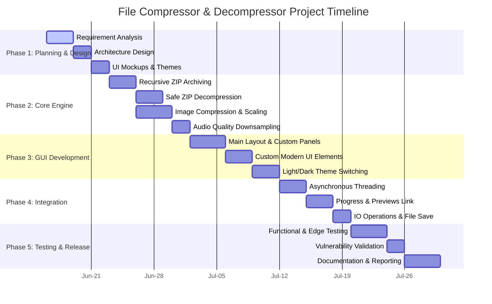
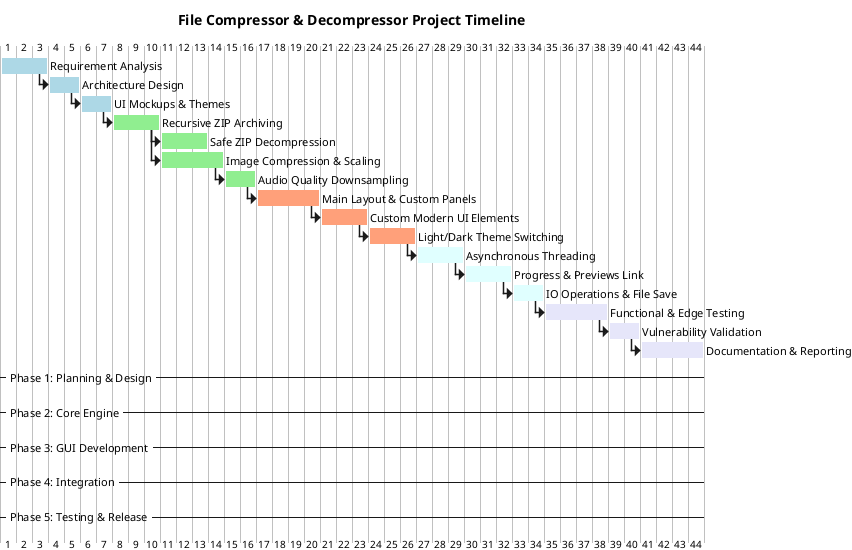

# File Compressor & Decompressor - Project Gantt Chart & Roadmap

This document outlines the structured 6-week development lifecycle for the **File Compressor & Decompressor** Java application, showing tasks, dependencies, mapping to the codebase (`Main.java`, `Compressor.java`, `Decompressor.java`), and current progress.

---

## 1. Project Development Timeline (Gantt Chart)

### Mermaid Format

### PlantUML Format

---

## 2. Detailed Project Plan Breakdown

The following table details the milestones, tasks, estimated durations, dependencies, and their corresponding files in the project.

| Phase | Task ID | Task Name | Duration | Dependencies | Target File(s) | Description |
| :--- | :--- | :--- | :--- | :--- | :--- | :--- |
| **Phase 1: Planning & Design** | **P1.1** | Requirement Analysis | 3 Days | None | `README.md`, `TODO.md` | Defining scopes (support for Images, ZIP, and WAV compression formats) and establishing system design parameters. |
| | **P1.2** | Architecture Design | 2 Days | P1.1 | - | Drawing class diagrams and determining dependencies (e.g., using `javax.swing`, `java.util.zip`, `javax.imageio`). |
| | **P1.3** | UI Mockups & Theme Config | 2 Days | P1.2 | `Main.java` | Defining typography (Inter font family) and light/dark color palette tokens (`Theme` static inner classes). |
| **Phase 2: Core Engine Development** | **P2.1** | Recursive ZIP Archiving | 3 Days | P1.3 | `Compressor.java` | Implementing directory tree traversal and multi-file recursive compressing into `ZipOutputStream`. |
| | **P2.2** | Safe ZIP Decompression | 3 Days | P2.1 | `Decompressor.java` | Implementing extraction logic with safety mechanisms against the Zip Slip vulnerability. |
| | **P2.3** | Image Compression & Scaling | 4 Days | P2.1 | `Compressor.java` | Implementing JPEG compression ratios using quality sliders, down-scaling large pictures for buffer safety. |
| | **P2.4** | Audio Quality Downsampling | 2 Days | P2.3 | `Compressor.java` | Downsampling WAV files using custom audio formatting (8kHz, 8-bit mono conversion). |
| **Phase 3: GUI Development** | **P3.1** | Layout & Structure | 4 Days | P2.4 | `Main.java` | Creating a split-view dashboard (Original Preview card on left, Output Preview card on right) using Swing components. |
| | **P3.2** | Custom Modern Components | 3 Days | P3.1 | `Main.java` | Creating custom components like `ModernButton` (anti-aliased rounded edges, interactive hover highlights) and `DashedBorder`. |
| | **P3.3** | Theme Toggle Implementation | 3 Days | P3.2 | `Main.java` | Connecting state switches to dynamically paint components between Light and Dark mode styles. |
| **Phase 4: Integration & Binding** | **P4.1** | Asynchronous Threading | 3 Days | P3.3 | `Main.java` | Implementing background worker threads (`new Thread().start()`) for compression to prevent UI thread lockups. |
| | **P4.2** | Preview & Progress Binding | 3 Days | P4.1 | `Main.java` | Linking real-time progress bars to compress tasks and loading thumbnails in pre/post compression view. |
| | **P4.3** | File Save & Export | 2 Days | P4.2 | `Main.java` | Implementing save dialogs to export files from temporary storage to the user-specified destination. |
| **Phase 5: Testing & Release** | **P5.1** | Functional & Edge Testing | 4 Days | P4.3 | - | Testing directory compression, large files, and compressed ratio calculations. |
| | **P5.2** | Vulnerability Validation | 2 Days | P5.1 | `Decompressor.java` | Running test suites against malicious ZIP archives to confirm the Zip Slip block. |
| | **P5.3** | Documentation & Reporting | 4 Days | P5.2 | `README.md` | Finalizing instructions, compilation guides, and project report structure. |

---

## 3. Project Implementation Status Check

- [x] **Planning & Design** (P1.1 - P1.3): Complete.
- [x] **Core Engine Logic** (P2.1 - P2.4): Complete.
- [x] **Swing Interface Layout** (P3.1 - P3.3): Complete.
- [x] **Process Integration & Threading** (P4.1 - P4.3): Complete.
- [ ] **Comprehensive Testing Suite** (P5.1 - P5.2): Pending final edge cases.
- [x] **Base Documentation** (P5.3): Done (`README.md` and project comments are configured).

> **Note:** The project codebase is highly modularized, with custom UI themes (Light/Dark toggles) and secure zip handling (protecting from directory traversal attacks) already fully built in. 
